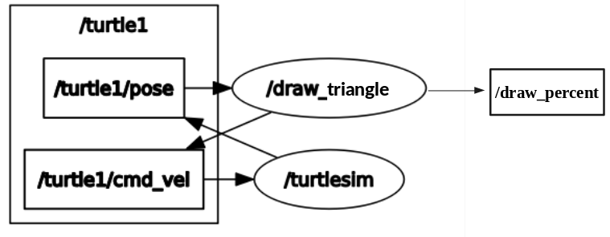

# GTU Rover ROS Challenge

## How to contribute?

1. Fork this repository.
2. Create a branch. Your branch name can be `challenge1/{github_username}` to avoid conflictions.
3. Commit your initial changes. This commit might include the inital file structure.
4. Push changes to GitHub.
5. Open a pull request. Make sure the status of pull request is **draft**.
6. As you progress, commit & push your changes to the branch you created. Existing pull request should be updated automatically.
7. Once you complete the challenge, change pull request status to **open**.

Detailed guide: https://github.com/firstcontributions/first-contributions/blob/main/README.md

## Challenge 1

In this challenge, you will create a ROS package in your catkin_ws with the name “challenge”. That package will contain the CMakeLists.txt file, package.xml file, scripts folder (for the python files if you use python), src folder (for the c++ files if you use c++), launch folder (for launch file), and msg (for your custom message) folder. You can also create an include folder if you want to create header file(s) for c++.

Your node file name will be draw_triangle.cpp/py and this node will provide the turtle in the turtlesim draw an equilateral triangle by asking the user the side length (side length can be a float). You will get the input from the terminal. After the drawing is completed your program will ask the user to draw a new triangle or exit. (beware of turtlesim's limits when taking the side length)

For this challenge, the turtle’s moving speed must be adjustable at the runtime. To handle this problem you should use the ROS parameter server. (http://wiki.ros.org/Parameter%20Server Client library support is at the end of the page.)
The parameter name will be turtle_speed and you will set it to 1.0 (as default) in your package`s launch file (You can look at the roslaunch card on Trello to learn how to write the launch file) in the launch folder. After the node is launched you will change the turtle_speed parameter using the rosparam set command. (If you make it 2.0 then your turtle’s speed will be increased by double)

Also, you will create your own message type for this challenge. This message will contain
a float32 whose name is “completed”. You will use this message to show how many percent are completed by publishing it to a topic called “/draw_percent”. Your message file will be in the msg folder of your package.

Your node-topic relation should look like this:

Rectangles are the topics, ellipses are the nodes, and /turtle1 is the namespace for the first turtle in the turtlesim.

